<div align="center">


<h1>Developer Experience Dashboard</h1>

<p><strong>The Enterprise Standard for Measuring, Improving, and Operationalizing Engineering Effectiveness</strong></p>

[]()
[]()
[]()
[]()

<br/>

> **"Developer experience is the leverage of the modern enterprise."** 
> Developer Experience Dashboard is a flagship platform designed to enable organizations to measure, improve, and operationalize engineering flow and productivity.

</div>

---

## 🏛️ Executive Summary

**Developer Experience Dashboard** is a flagship repository designed for Chief Technology Officers (CTOs), Engineering Leaders, and Platform Strategists. As engineering organizations scale, the "Cognitive Load" of fragmented tools and complex environments becomes the primary constraint on delivery velocity.

This platform provides an industrialized approach to **Engineering Effectiveness**, delivering production-ready **Productivity Analytics**, **DORA Metrics Center**, **Flow Efficiency Insights**, and **Developer Satisfaction Scorecards**. It integrates with **GitHub**, **Jira**, **Backstage**, and **Kubernetes**, enabling leaders to transition from "Opinion-Based" to "Data-Driven" engineering management.

---

## 💡 Why Developer Experience Matters

DevEx is the foundation of high-performance engineering:
- **Velocity**: Reducing the "Time-to-Insight" by optimizing PR cycles and build durations.
- **Retention**: Improving developer satisfaction by removing friction and cognitive burden.
- **Efficiency**: Identifying and eliminating bottlenecks in the internal development lifecycle.
- **Flow**: Enabling engineers to stay in the "Zone" by providing high-quality internal tooling and clear paths to production.

---

## 🚀 Business Outcomes

### 🎯 Strategic Productivity Impact
- **Industrialized Onboarding**: Reducing the time-to-first-commit for new hires by 50%.
- **Optimized Flow**: Increasing engineering throughput by identifying and removing cross-team dependencies.
- **Platform Adoption**: Measuring the ROI of internal developer platforms (IDPs) through usage telemetry.
- **Executive Visibility**: Providing a single pane of glass for organizational health and delivery performance.

---

## 🏗️ Technical Stack

| Layer | Technology | Rationale |
|---|---|---|
| **Metrics Engine** | Python, Pandas | High-performance calculation of DORA, Flow, and Satisfaction metrics. |
| **Control Plane** | FastAPI | High-performance API for integration management and data orchestration. |
| **Frontend** | React 18, Vite | Premium portal for executive dashboards, team scorecards, and roadmap planning. |
| **IaC Foundation** | Terraform | Multi-cloud infrastructure consistency and platform foundation automation. |
| **Database** | PostgreSQL | Centralized repository for productivity metadata, integration state, and history. |
| **Observability** | Prometheus / Grafana | Real-time monitoring of dashboard performance and integration sync health. |

---

## 📐 Architecture Storytelling: 65+ Diagrams

### 1. Executive High-Level Architecture
The holistic vision of the enterprise engineering effectiveness journey.

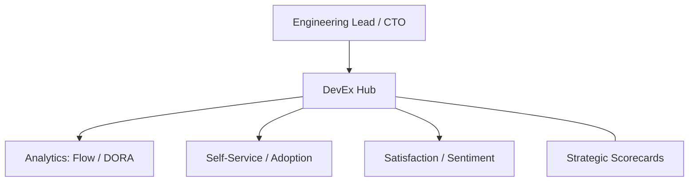

### 2. Detailed Component Topology
The internal service boundaries and management layers of the platform.

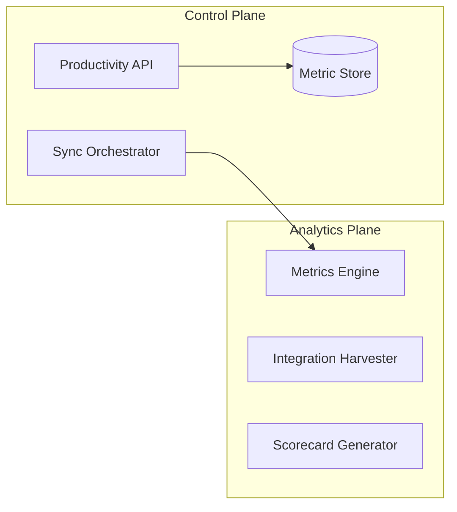

### 3. Frontend to Backend Request Path
Tracing a "DORA Metric Refresh" request through the stack.

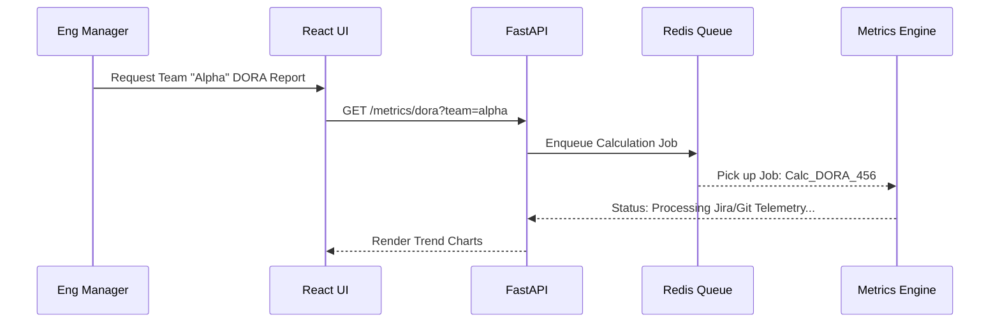

### 4. Metrics Control Plane
The "Brain" of the framework managing global productivity definitions.

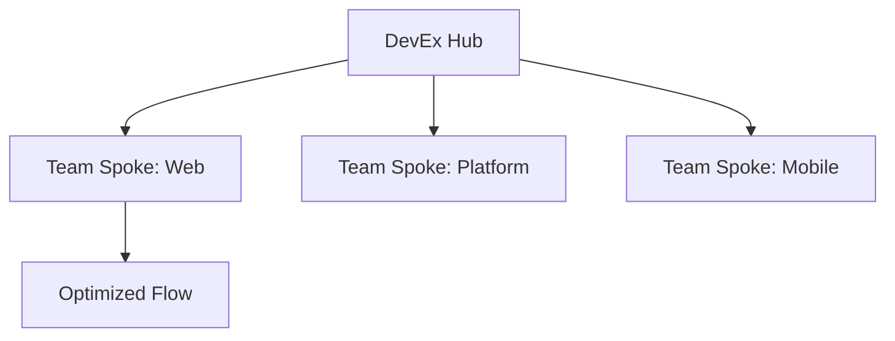

### 5. Multi-Cloud Topology
Synchronizing productivity standards across Azure, AWS, and GCP.

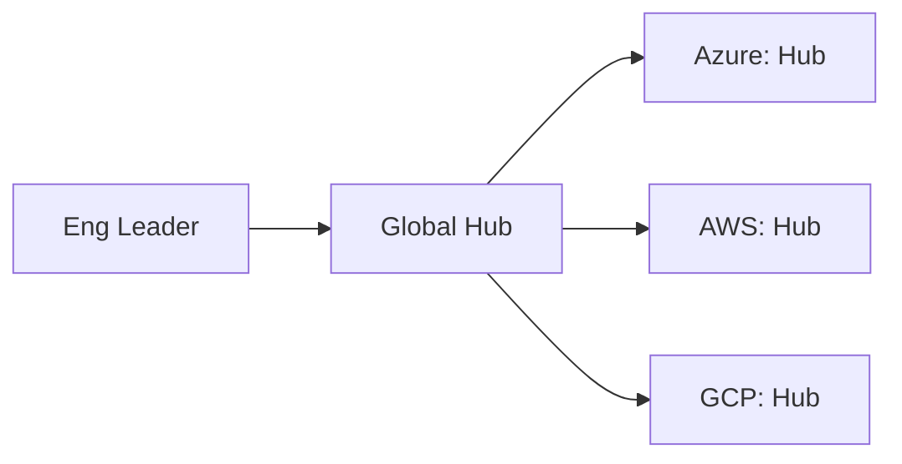

### 6. Regional Deployment Model
Hosting metrics workers close to the developer tools for performance.

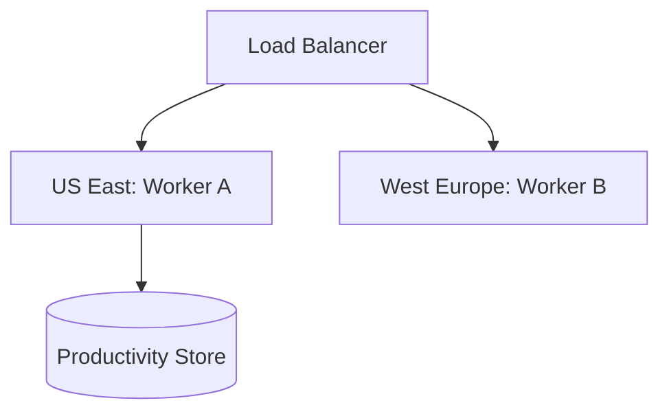

### 7. DR Failover Model
Ensuring analytics continuity during regional cloud outages.

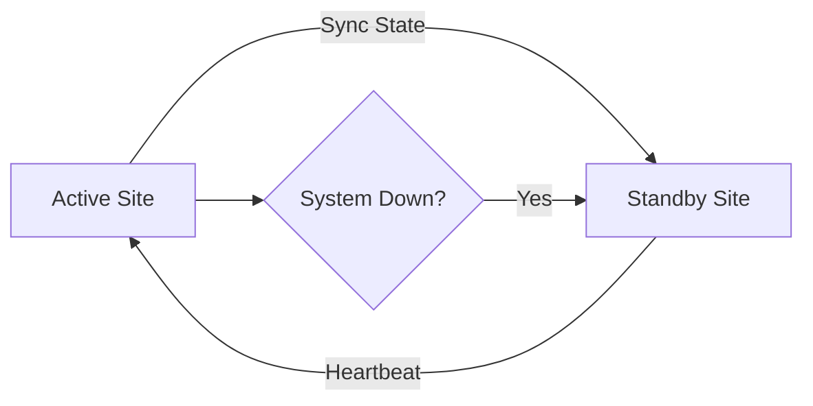

### 8. API Gateway Architecture
Securing and throttling the entry point for productivity orchestration.

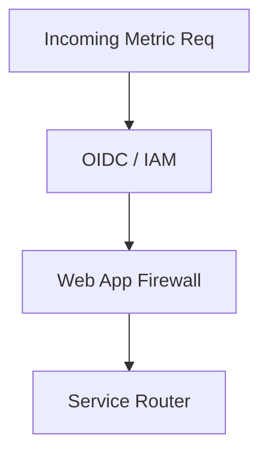

### 9. Queue Worker Architecture
Managing long-running data sync and calculation tasks at scale.

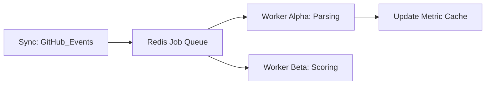

### 10. Dashboard Analytics Flow
How raw tool telemetry becomes executive engineering scorecards.

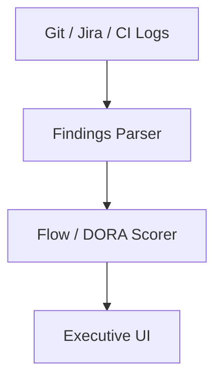

### 11. DORA Metrics Pipeline
The automated ingestion and transformation of DORA events.

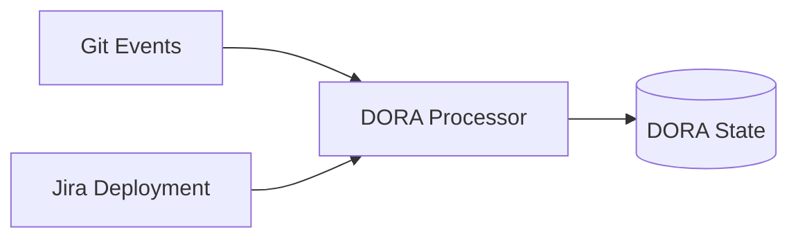

### 12. Lead Time Calculation Model
Measuring the time from code commit to production.

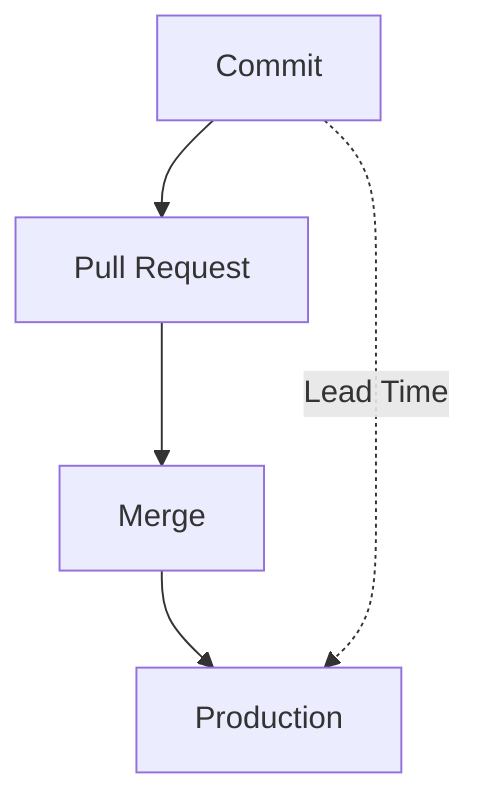

### 13. Deployment Frequency Workflow
Tracking how often the organization delivers value.

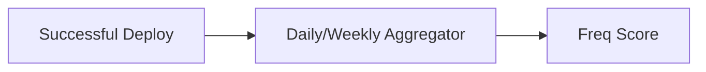

### 14. Change Failure Rate Model
Measuring the percentage of deployments that cause an incident.

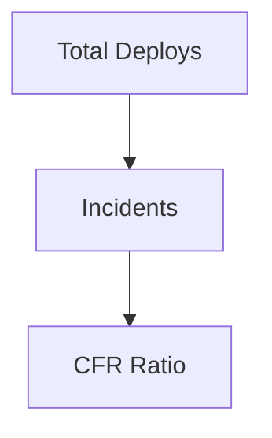

### 15. MTTR Analytics Flow
Calculating the time to restore service after a failure.

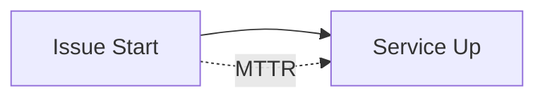

### 16. PR Cycle Time Workflow
Identifying friction in the code review process.

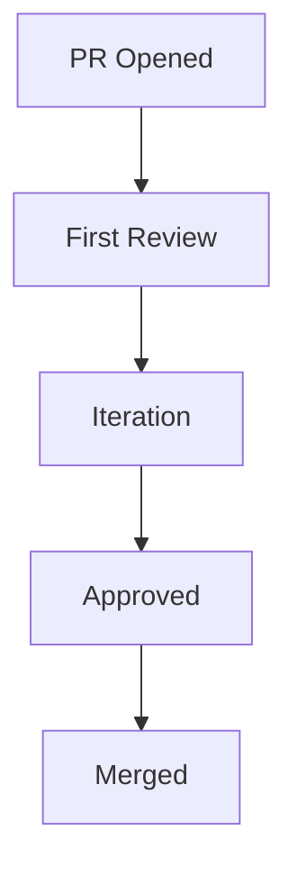

### 17. Review Bottleneck Detection
Identifying engineers or teams overwhelmed by PR requests.

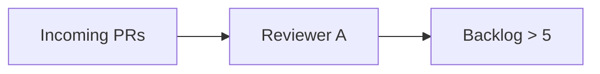

### 18. Work in Progress Flow
Monitoring the amount of active development per engineer.

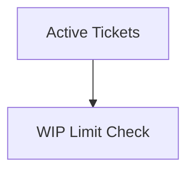

### 19. Engineering Flow Efficiency
The ratio of active coding time to wait time.

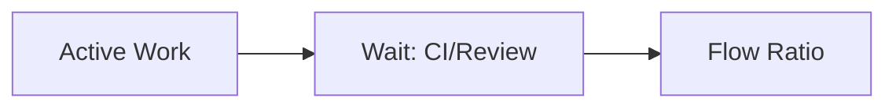

### 20. Context Switching Heatmap
Visualizing disruptions across the engineering day.

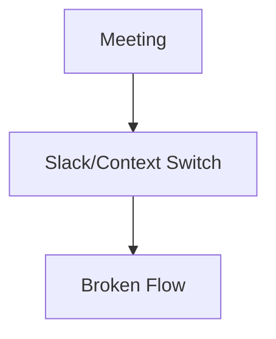

### 21. Golden Path Onboarding Flow
The standardized journey for a new engineer to reach productivity.

```mermaid
graph LR
    Day1[Setup] --> Day3[First PR]
    Day3 --> Day7[Production]
```

### 22. New Hire Day-1 Setup Model
Automating environment provisioning for new joiners.

```mermaid
graph TD
    HR[HR Event] --> Auth[Okta/IDP]
    Auth --> Tooling[Provision: Git/Slack]
```

### 23. Self-Service Portal Workflow
Enabling developers to provision resources without tickets.

```mermaid
graph LR
    User[Dev] --> Portal[IDP]
    Portal --> TF[Terraform Apply]
```

### 24. Template usage analytics
Measuring the adoption of "Golden Path" templates.

```mermaid
graph TD
    Templ[Template A] --> Usage[Usage Count]
```

### 25. Backstage Adoption Model
Tracking how engineers interact with the Service Catalog.

```mermaid
graph LR
    Search[Search Service] --> Entity[View Metadata]
```

### 26. Internal Platform Dependency Map
Visualizing the services and tools developers rely on.

```mermaid
graph TD
    App[Consumer App] --> DB[Shared DB]
    App --> CI[Shared CI]
```

### 27. CLI Telemetry Workflow
Measuring the speed and reliability of internal developer tools.

```mermaid
graph LR
    CLI[dx-cli] --> Stats[Command Duration]
```

### 28. Docs Search Experience Flow
Identifying gaps in internal engineering documentation.

```mermaid
graph TD
    Query[How to deploy?] --> Result[Found/Not Found]
```

### 29. Support Ticket Reduction Model
Measuring the impact of platform improvements on ticket volume.

```mermaid
graph LR
    IDP[IDP Feature] --> Tickets[Reduced Jira Tickets]
```

### 30. Developer Journey Lifecycle
The end-to-end experience from hire to lead.

```mermaid
graph TD
    Hire[Hire] --> Onboard[Onboard]
    Onboard --> Deliver[Deliver]
    Deliver --> Growth[Growth]
```

### 31. GitHub Actions analytics
Measuring runner efficiency and pipeline success rates.

```mermaid
graph LR
    Workflow[YAML] --> Runtime[Runner Stats]
```

### 32. Jenkins pipeline metrics
Tracking legacy pipeline performance and migration progress.

```mermaid
graph TD
    Job[Build] --> Duration[Duration Trend]
```

### 33. ArgoCD deployment workflow
Measuring the velocity of GitOps-driven releases.

```mermaid
graph LR
    Git[Git] --> Sync[Sync Status]
```

### 34. Kubernetes release model
Visualizing pod stability and rollout speed in K8s.

```mermaid
graph TD
    Manifest[Apply] --> Health[Pod Health]
```

### 35. Build Cache Optimization
Measuring the impact of caching on developer wait times.

```mermaid
graph LR
    Cache[Cache Hit] --> Time[Time Saved]
```

### 36. Failed pipeline triage
Analyzing common causes of build failures across the org.

```mermaid
graph TD
    Logs[Logs] --> Category[Logic/Infra/Network]
```

### 37. Release approval lifecycle
Tracking the time spent waiting for human sign-offs.

```mermaid
graph LR
    Ready[Ready] --> Wait[Approval Pending]
```

### 38. Rollback event analysis
Identifying patterns in unstable releases.

```mermaid
graph TD
    Rollback[Rollback] --> RootCause[Cause Category]
```

### 39. Environment wait time model
Measuring the bottleneck caused by shared environment availability.

```mermaid
graph LR
    Dev[Need Env] --> Wait[Wait: 2 Days]
```

### 40. Artifact Promotion Flow
The speed of moving binaries from Dev to Prod.

```mermaid
graph TD
    Dev_Art[Dev] --> Staging_Art[Staging]
    Staging_Art --> Prod_Art[Prod]
```

### 41. Pulse survey workflow
Capturing real-time developer sentiment.

```mermaid
graph LR
    Slack[Slack Bot] --> Survey[How is your week?]
    Survey --> Sentiment[Sentiment Score]
```

### 42. Sentiment trend model
Visualizing organizational morale over time.

```mermaid
graph TD
    Data[Survey Results] --> Trend[Mood Line]
```

### 43. Burnout risk indicators
Correlating high WIP and long hours with attrition risk.

```mermaid
graph LR
    Work[High WIP] --> Risk[Burnout Alert]
```

### 44. Team benchmark comparison
Helping teams understand their performance relative to the org.

```mermaid
graph TD
    Team_A[Team A] vs Team_B[Team B]
```

### 45. Executive KPI review cycle
The rhythm of presenting effectiveness data to leadership.

```mermaid
graph LR
    Month[Stats] --> Review[Leadership QBR]
```

### 46. Cost-to-delivery model
Calculating the engineering investment per shipped feature.

```mermaid
graph TD
    Salary[Payroll] + Tooling[SaaS] --> Feature_Cost[Unit Cost]
```

### 47. Capacity forecast workflow
Predicting future delivery potential based on historical velocity.

```mermaid
graph LR
    History[Past Vel] --> Predict[Future Cap]
```

### 48. Quarterly improvement plan
The cycle of identifying and fixing DevEx friction.

```mermaid
graph TD
    Findings[Pain Points] --> Action[Platform Fix]
```

### 49. ROI of platform engineering
Calculating the business value of improved engineering flow.

```mermaid
graph LR
    Time_Saved[Time Saved] --> Value[$ Saved]
```

### 50. Adoption maturity roadmap
The journey to full self-service engineering.

```mermaid
graph TD
    P1[Manual] --> P4[Self-Service]
```

### 51. OIDC / SSO Auth Flow
Securing the DevEx dashboard with enterprise identity.

```mermaid
graph LR
    User[Manager] --> SSO[Azure AD / Okta]
```

### 52. RBAC Model
Defining permissions for managers, platform leads, and engineers.

```mermaid
graph TD
    Role[Lead] --> Action[View All Team Stats]
```

### 53. Secrets Management Flow
Securing API keys for tool integrations (GitHub/Jira).

```mermaid
graph LR
    Vault[HashiCorp/KV] --> Worker[Inject Secret]
```

### 54. Audit logging architecture
Tracking who viewed what metrics for privacy compliance.

```mermaid
graph TD
    View[View Stats] --> Log[Audit Database]
```

### 55. Metrics Pipeline
Monitoring the dashboard's own internal metrics.

```mermaid
graph LR
    App[Dashboard] --> Prom[Prometheus]
```

### 56. Logging Architecture
Centralized application and integration logs.

```mermaid
graph TD
    Pods[API/Workers] --> ELK[Elastic/Loki]
```

### 57. Tracing Model
Tracing data sync requests across distributed integration workers.

```mermaid
graph LR
    Sync[Sync Req] --> Trace[OpenTelemetry]
```

### 58. Incident Response workflow
Handling failures in the productivity data pipeline.

```mermaid
graph TD
    Fail[Sync Failed] --> Alert[Platform Team]
```

### 59. Release governance model
Governing updates to the DevEx platform itself.

```mermaid
graph LR
    Edit[New Metric] --> PR[Code Review]
```

### 60. Change management workflow
Ensuring metric definitions are versioned and approved.

```mermaid
graph TD
    Change[New Algo] --> Appr[Review Committee]
```

### 61. AI insight recommendation flow
Using ML to suggest specific engineering improvements.

```mermaid
graph LR
    Data[Stats] --> AI[Insight Engine]
    AI --> Rec[Rec: Fix PR Latency]
```

### 62. Anomaly detection model
Identifying unusual drops in velocity or satisfaction.

```mermaid
graph TD
    Normal[Baseline] --> Anomaly[Velocity Drop]
```

### 63. Predictive attrition risk (aggregate)
(Anonymized) Predictions of team-level turnover risks.

```mermaid
graph LR
    Signals[Low Mood/High WIP] --> Predict[Team Risk]
```

### 64. Engineering capacity planning
Projecting hiring needs based on delivery objectives.

```mermaid
graph TD
    Roadmap[Product Goals] --> Headcount[Required FTE]
```

### 65. Continuous improvement loop
The ultimate Data-Driven engineering feedback cycle.

```mermaid
graph LR
    Measure[Measure] --> Improve[Improve]
    Improve --> Measure
```

---

## 🔬 Developer Experience Methodology

### 1. The DevEx Pillars
Our platform is built on four core pillars:
- **Flow**: Enabling uninterrupted, focused engineering work through cognitive load reduction.
- **Productivity**: Measuring the speed and frequency of delivery without compromising quality.
- **Platform Adoption**: Quantifying the impact and ROI of internal developer tools and "Golden Paths."
- **Satisfaction**: Capturing the human sentiment and morale that drives sustainable performance.

### 2. DORA vs. DevEx
While DORA metrics (Velocity/Quality) provide the "What," DevEx provides the "Why." By correlating CI/CD performance with developer sentiment and tool friction, we provide the full context of engineering health.

---

## 🚦 Getting Started

### 1. Prerequisites
- **Terraform** (v1.5+).
- **Docker Desktop**.
- **GitHub/Jira API Tokens** for integration.

### 2. Local Setup
```bash
# Clone the repository
git clone https://github.com/Devopstrio/developer-experience-dashboard.git
cd developer-experience-dashboard

# Start the DevEx Hub
docker-compose up --build
```
Access the Dashboard at `http://localhost:3000`.

---

## 🛡️ Governance & Security
- **Privacy by Design**: Individual engineer metrics are aggregated at the team level to prevent surveillance.
- **Immutable Metrics**: Metric definitions are managed as code and peer-reviewed for fairness.
- **Secure Integrations**: All tool connectivity uses short-lived tokens and OIDC where possible.

---
<sub>&copy; 2026 Devopstrio &mdash; Engineering the Future of Developer Experience and Productivity.</sub>
