<div align="center">


<h1>Developer Experience Dashboard</h1>

<p><strong>The Institutional-Grade Platform for Standardized DevEx Foundations, Engineering Flow Governance, and Multi-Cloud Productivity Ecosystems.</strong></p>

[]()
[]()
[]()

<br/>

> **"Industrializing flow analytics to automate developer experience foundations."** 
> **Developer Experience Dashboard** is an enterprise-grade platform designed to provide a secure, measurable, and highly automated foundation for global engineering productivity operations. It orchestrates the complex lifecycle of developer experience—from toolchain integration and DORA metrics calculation to cognitive load analysis and unified effectiveness auditing.

</div>

---

## 🏛️ Executive Summary

Fragmented developer toolchains and manual metric gathering are strategic operational liabilities; lack of centralized DevEx orchestration is a primary barrier to organizational engineering maturity. Organizations fail to maintain a high-performing engineering culture not because of a lack of talent, but because of fragmented measurement standards, lack of automated friction identification, and an inability to orchestrate productivity planes with operational precision.

This platform provides the **DevEx Intelligence Plane**. It implements a complete **DevEx-Dashboard-as-Code Framework**, enabling Engineering Leaders and Platform teams to manage global developer experience foundations as first-class citizens. By automating the identification of delivery bottlenecks through real-time telemetry analysis and orchestrating the provisioning of secure performance-driven flow policies, we ensure that every organizational team—from core platform engineers to product feature squads—is supported by default, audited for history, and strictly aligned with institutional effectiveness frameworks (DORA, SPACE).

---

## 📐 Architecture Storytelling: Principal Reference Models

### 1. Principal Architecture: Global Developer Experience Dashboard & DevEx Intelligence Plane
This diagram illustrates the end-to-end flow from toolchain telemetry ingestion and multi-cloud orchestration to delivery enforcement, performance validation, and institutional DevEx auditing.

```mermaid
graph LR
    %% Subgraph Definitions
    subgraph TelemetryIngress["Toolchain & Sentiment Ingress"]
        direction TB
        VCS_CI["Git / CI/CD Pipelines / IDEs"]
        Project_Mgmt["Jira / Incident Mgmt / Backstage"]
        Surveys["Developer Pulse & Sentiment"]
    end

    subgraph IntelligenceEngine["DevEx Intelligence Hub"]
        direction TB
        API["FastAPI Analytics Gateway"]
        AnalyticsOrchestrator["Global Flow & Productivity Hub"]
        Governance_Hub["Privacy & Compliance Guardrail Hub"]
        AIOps_Validator["Drift & Friction Analysis Hub"]
    end

    subgraph OperationsPlane["Distributed Analytics Ecosystem"]
        direction TB
        ManagedLakes["Managed Standardized Metrics Lakes"]
        ActivePipelines["Managed Automated Flow Pipelines"]
        ReportingSinks["Managed Infrastructure Delivery Hubs"]
    end

    subgraph OperationsHub["Institutional DevEx Hub"]
        direction TB
        Scorecard["DevEx Maturity Scorecard"]
        Analytics["Delivery Flow & Readiness Velocity Stats"]
        Audit["Forensic Effectiveness Metadata Lake"]
    end

    subgraph DevOps["DevEx-Dashboard-as-Code Framework"]
        direction TB
        TF["Terraform Analytics Modules"]
        DriftBot["Productivity & Config Drift Validator"]
        ChatOps["Measurement Operations Hub"]
    end

    %% Flow Arrows
    TelemetryIngress -->|1. Submit Telemetry| API
    API -->|2. Orchestrate Analytics| AnalyticsOrchestrator
    AnalyticsOrchestrator -->|3. Apply Privacy Guard| Governance_Hub
    Governance_Hub -->|4. Assess Drift| AIOps_Validator
    
    AIOps_Validator -->|5. Execute Calculation| OperationsPlane
    OperationsPlane -->|6. Notify Status| ChatOps
    API -->|7. Visualize Health| Scorecard
    
    Scorecard -->|8. Track Maturity| Analytics
    Scorecard -->|9. Record Performance| Audit
    
    TF -->|10. Provision Backbone| IntelligenceEngine
    DriftBot -->|11. Inject Friction Risk| AnalyticsOrchestrator
    Audit -->|12. Improve Operations| ManagedLakes

    %% Styling
    classDef ingress fill:#f5f5f5,stroke:#616161,stroke-width:2px;
    classDef intel fill:#e8eaf6,stroke:#1a237e,stroke-width:2px;
    classDef operations fill:#e1f5fe,stroke:#01579b,stroke-width:2px;
    classDef ops fill:#ede7f6,stroke:#311b92,stroke-width:2px;
    classDef devops fill:#e8f5e9,stroke:#1b5e20,stroke-width:2px;

    class TelemetryIngress ingress;
    class IntelligenceEngine intel;
    class OperationsPlane operations;
    class OperationsHub ops;
    class DevOps devops;
```

### 2. The DevEx Lifecycle Flow
The continuous path of a developer experience platform from initial integration (toolchain) and aggregation (metrics) to active analysis (friction), optimization (flow), and institutional forensic auditing (scorecard).

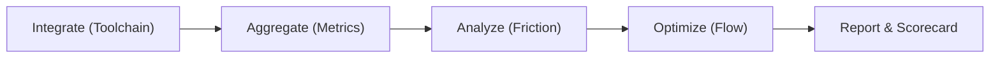

### 3. Distributed Telemetry Topology
Strategically orchestrating standardized analytics across global engineering hubs, diverse Git repositories, and multi-cloud platforms, providing a unified institutional view of global productivity health and operational readiness.

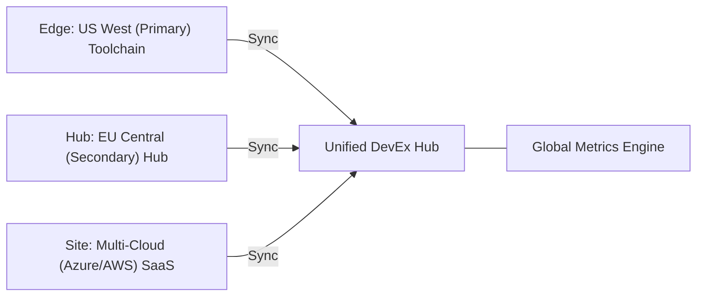

### 4. DevEx Governance & High-Trust Data Plane Protection Flow
Executing complex logic for securing the bridge between developer tools and executive dashboards, ensuring every organizational identity is verified, team-level privacy is maintained, and every telemetry access is according to institutional standards.

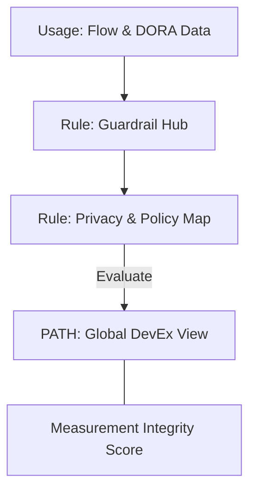

### 5. Multi-Region Experience Federation & Governance Flow
Automatically managing unified developer productivity standards across global regions and diverse business units, ensuring institutional data residency and privacy boundaries by default.

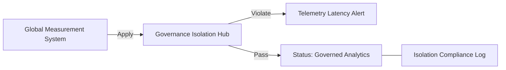

### 6. Encryption & Perimeter Protection Flow (DevEx Standard)
Managing the lifecycle of an analytics request, automatically enforcing institutional TLS 1.3 and resource encryption standards as required by security policy, ensuring zero-latency security confidence.

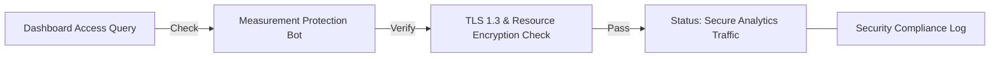

### 7. Institutional DevEx Maturity Scorecard
Grading organizational performance based on key indicators: PR Cycle Time Efficiency, Flow Efficiency Index, and Platform Adoption Scores.

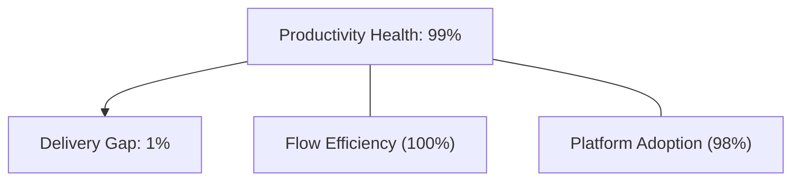

### 8. Identity & RBAC for DevEx Governance
Managing fine-grained access to analytics hubs, provisioning workers, and audit logs between CTOs, Engineering Managers, and Developers.

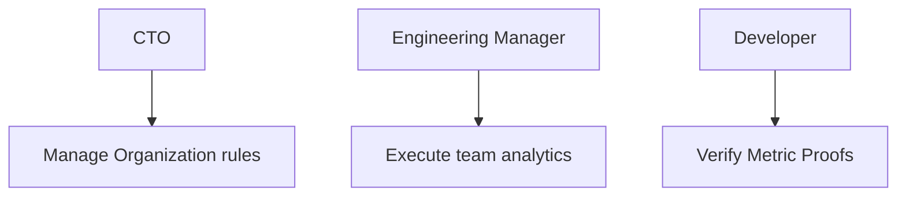

### 9. IaC Deployment: DevEx-Dashboard-as-Code Framework
Using modular Terraform to deploy and manage the versioned distribution of the analytics tracking hubs, policy protection workers, and forensic metadata lakes.

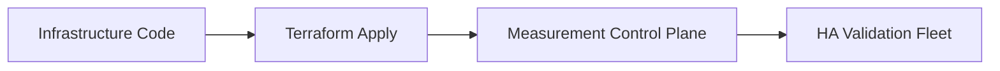

### 10. AIOps Experience Drift & Risk Validation Flow
Using advanced analytics to identify sudden surges in build wait times, unauthorized process bypasses, suspicious configuration drifts, or unusual delivery pattern changes that could result in institutional risk or developer burnout.

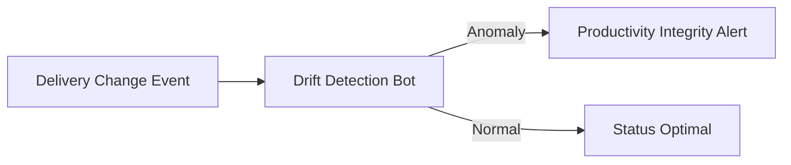

### 11. Metadata Lake for Forensic DevEx Audit
Storing long-term records of every tool integration event (metadata), every sprint executed, and every MTTR timeline history for institutional record-keeping, compliance auditing, and post-provisioning forensics.

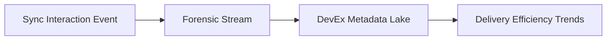

---

## 🏛️ Core Governance Pillars

1.  **Unified Foundation Coordination**: Maximizing productivity by centralizing all engineering measurement through a single institutional plane.
2.  **Automated Analytics Provisioning**: Eliminating "manual reporting" scenarios through proactive orchestration and pattern verification.
3.  **Sequential Flow Intelligence**: Ensuring zero-interruption operations through dependency-aware telemetry-driven delivery engineering.
4.  **Zero-Trust Privacy Protection**: Automatically enforcing identity-based access, team-level aggregation, and privacy evaluation across all analytics tiers.
5.  **Autonomous Operations Logic**: Guaranteeing reliability through automated industry-specific effectiveness monitoring runbooks.
6.  **Full Measurement Auditability**: Immutable recording of every metric change and analytics provision for institutional forensics.

---

## 🛠️ Technical Stack & Implementation

### Analytics Engine & APIs
*   **Framework**: Python 3.11+ / FastAPI.
*   **Performance Engine**: Custom Python-based logic for multi-toolchain telemetry ingestion and DORA-style readiness metrics.
*   **Integrations**: Native connectors for GitHub, GitLab, Jira, and Backstage APIs.
*   **Persistence**: PostgreSQL (DevEx Ledger) and Redis (Live Flow State).
*   **Auth Orchestrator**: Federated OIDC/SAML for least-privilege analytics management access.

### Governance Dashboard (UI)
*   **Framework**: React 18 / Vite.
*   **Theme**: Dark, Slate, Indigo (Modern high-fidelity productivity aesthetic).
*   **Visualization**: D3.js for delivery topologies and Recharts for readiness velocity analytics.

### Infrastructure & DevOps
*   **Runtime**: AWS EKS or Azure Kubernetes Service (AKS) for management plane.
*   **Measurement Hub**: Managed event sourcing for immutable productivity timeline reconstruction.
*   **IaC**: Modular Terraform for deploying the analytics landing zone and validation fleet.

---

## 🏗️ IaC Mapping (Module Structure)

| Module | Purpose | Real Services |
| :--- | :--- | :--- |
| **`infrastructure/measurement_hub`** | Central management plane | EKS, PostgreSQL, Redis |
| **`infrastructure/collectors`** | Distributed toolchain workers | Azure, AWS, GCP APIs |
| **`infrastructure/ingestion_pipes`** | Telemetry Ingestion Hubs | Webhooks, Lambda |
| **`infrastructure/auditing`** | Forensic effectiveness sinks | S3, Athena, Quicksight |

---

## 🚀 Deployment Guide

### Local Principal Environment
```bash
# Clone the DevEx Dashboard repository
git clone https://github.com/devopstrio/developer-experience-dashboard.git
cd developer-experience-dashboard

# Configure environment
cp .env.example .env

# Launch the Analytics stack
make init

# Trigger a mock telemetry update and automated guardrail validation simulation
make simulate-devex
```

Access the Management Portal at `http://localhost:3000`.

---

## 📜 License
Distributed under the MIT License. See `LICENSE` for more information.

---
<div align="center">
  <p>© 2026 Devopstrio. All rights reserved.</p>
</div>
